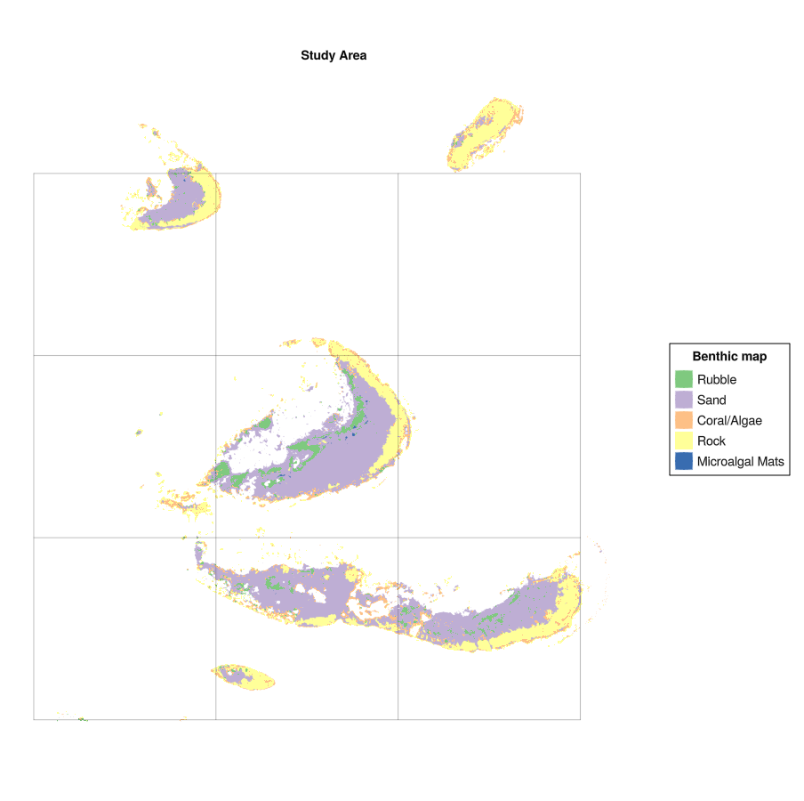
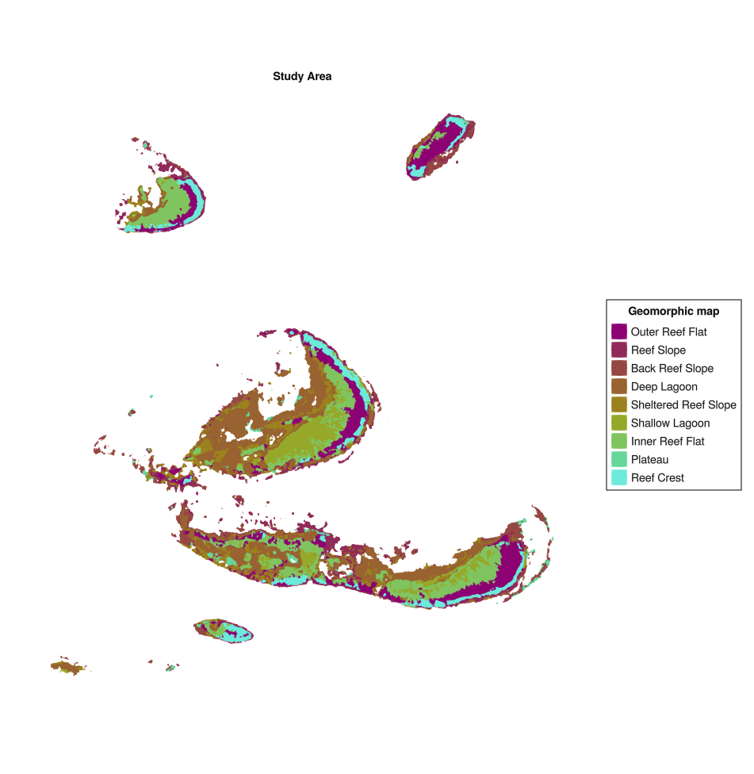
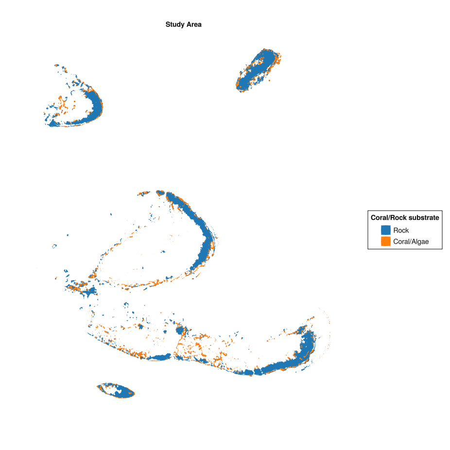
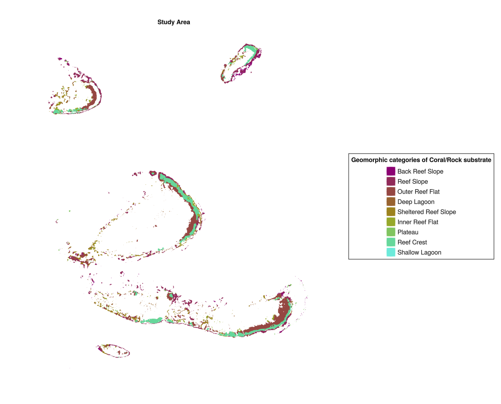
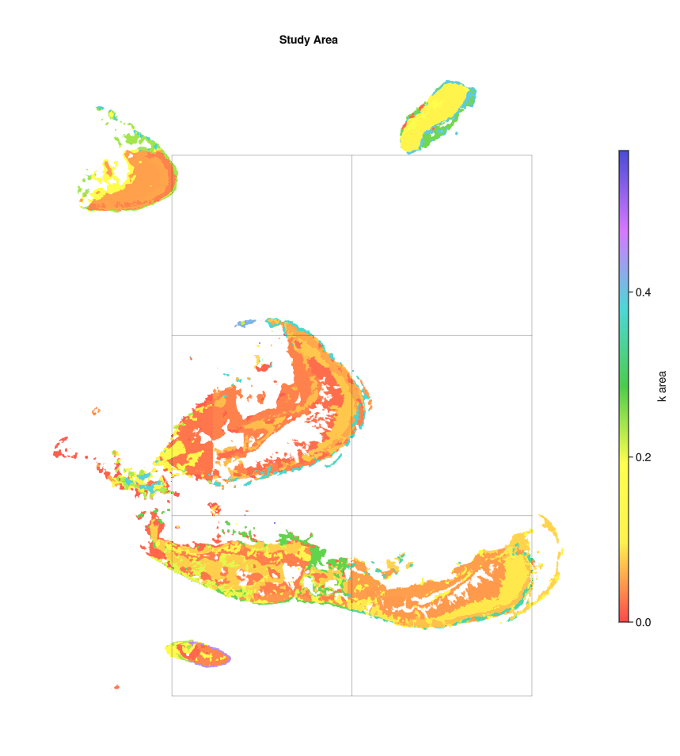
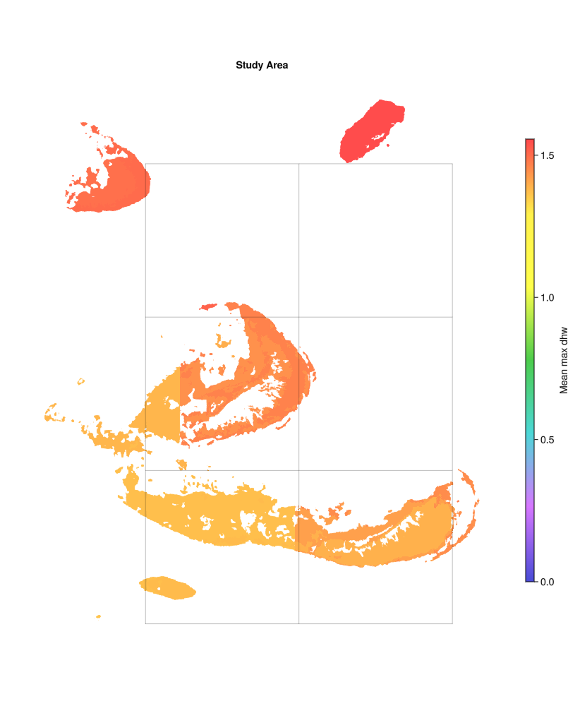

# ReefBiodiversityAccountSetup.jl

Spatial analyses and plots using open access data to inform setup of a reef biodiversity account. Datasets downloadable from the Allen Coral Atlas (<https://www.allencoralatlas.org/>) and NOAA coral reef watch (<https://coralreefwatch.noaa.gov/satellite/index.php>).

## Development

This repository is in active development. If you see an issue or have suggestions, submit a GitHub issue.

## Example usage

Download datasets from <https://www.allencoralatlas.org/> to analyse potential for setting up a reef biodiversity account.

```julia
using GLMakie, GeoMakie, GraphMakie
import ReefBiodiversityAccountSetup as RBAS

# Load config file to get data locations
config_file = RBAS.spatial_analysis.load_config(; config_path="../config.toml")

# Load benthic, geomorphic and extent data for whole of GBR
benthic, geomorphic, reef_extent = RBAS.spatial_analysis.load_spatial_base(config_file)

# Set lat and long box limits for loading account data
box_upper = (-16.75284, 146.15641)
box_lower = (-16.95082, 146.32396)

# Get benthic and geomorphic data within the account box
benthic = RBAS.spatial_analysis.get_geo_within_box(benthic, box_upper, box_lower)
geomorphic = RBAS.spatial_analysis.get_geo_within_box(geomorphic, box_upper, box_lower)
extent = RBAS.spatial_analysis.get_geo_within_box(reef_extent, box_upper, box_lower)

# Plot benthic and geomorphic data
fig_benthic = RBAS.plotting.spatial_map(
    benthic,
    benthic[:, :class];
    opts=Dict(:legend_name => "Benthic map",
        :color_map => :Accent_5)
)
fig_geomorphic = RBAS.plotting.spatial_map(
    geomorphic,
    geomorphic[:, :class];
    opts=Dict(:legend_name => "Geomorphic map",
        :color_map => :hawaii10)
)
```




Establish benthic and geomorphic maps of potential coral-supporting substrate.

```julia
# Filter for Coral/Algae type
benthic_filtered = RBAS.spatial_analysis.filter_site_area(benthic)

# Get intersection of geomorphic polygons and account extent
geomorphic_ext = RBAS.spatial_analysis.multipoly_geom_intersection(
    extent, geomorphic, :class
)
# Get intersection of benthic filtered polygons and account extent
benthic_ext = RBAS.spatial_analysis.multipoly_geom_intersection(
    extent, benthic_filtered, :class
)
# Get intersection of benthic filtered polygons and geomorphic polygons
geomorphic_benthic_comb = RBAS.spatial_analysis.multipoly_geom_intersection(
    benthic_ext, geomorphic_ext, :class
)

fig_benthic_filtered = RBAS.plotting.spatial_map(
    benthic_ext,
    benthic_ext[:, :class];
    opts=Dict(:legend_name => "Coral/Rock substrate",
        :color_map => :imolaS)
)

fig_geomorphic_filtered = RBAS.plotting.spatial_map(
    geomorphic_benthic_comb,
    geomorphic_benthic_comb[:, :class];
    opts=Dict(:legend_name => "Geomorphic categories of Coral/Rock substrate",
        :color_map => :hawaii10)
)

```




Estimate area available to support coral based on total site areas and proportion of Rock/Coral/Algal benthos.

```julia
# Project and add polygon areas and proportion of Rock/Coral/Algal benthos to gdf
geomorphic_filtered = RBAS.spatial_analysis.set_reef_k(
    geomorphic_ext, benthic_ext)

# Plot area as spatial heat map
fig_k_filtered = RBAS.plotting.spatial_map(
    geomorphic_filtered,
    geomorphic_filtered[:, :k];
    opts=Dict(:colorbar_label => "k area",
        :color_map => Reverse(:lighttest))
)

```


Extract DHWs from data downloaded from NOAA's Coral Reef Watch (<https://coralreefwatch.noaa.gov/satellite/index.php>)

```julia
# Extract broadscale NOAA DHWs
geomorphic_filtered, dhws = RBAS.spatial_analysis.noaa_dhw_means(geomorphic_filtered, config_file)

# Plot mean and std for dhws
fig_dhw_mean = RBAS.plotting.spatial_map(
    geomorphic_filtered,
    geomorphic_filtered[:, :dhw_hist_mean];
    opts=Dict(:colorbar_label => "Mean max dhw",
        :color_map => :lighttest)
)

```


Plot other available rasters in the Allen Atlas, such as turbidity

```julia
# Allen atlas turbidity data
turb_fn = config_file["other_data"]["allen_turbid"]

# Add turbidity data from Allen Atlas
geomorphic_filtered, turbidity = RBAS.spatial_analysis.median_features_allen(
    geomorphic_filtered, turb_fn; data_name=:turb_med
)

```

Suggest impact and control sites for a restoration activity

```julia
impact_site_rating = RBAS.spatial_analysis.suggest_impact_sites(geomorphic_filtered; sorted=false)

geomorphic_filtered[!, :ID] = collect(1:size(geomorphic_filtered,1))

# Suggest control sites for a particular impact site (e.g. 5)
control_site_list = RBAS.spatial_analysis.suggest_control_sites(5, geomorphic_filtered[:,Not(:geom)], [:class]; ID_COLUMN=:ID)
```
