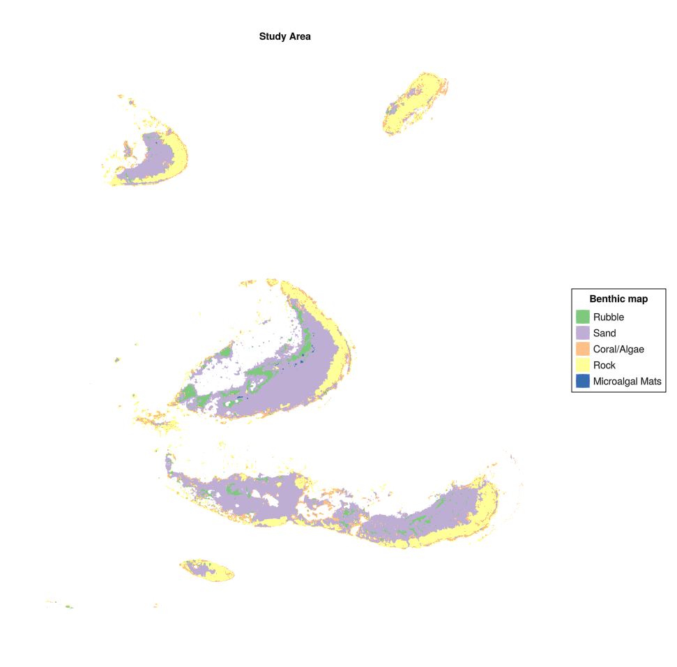
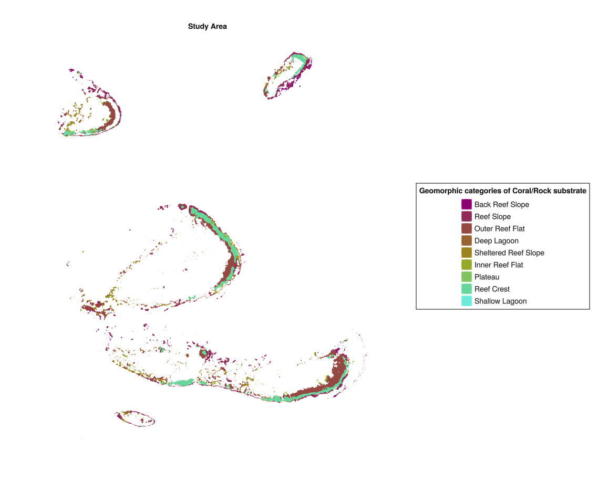

# ReefBiodiversityAccountSetup.jl Documentation

```@contents
```
## Installation
Download the package using the Julia package installer,

```julia
pkg> add ReefBiodiversityAccountSetup
```
## Introduction
ReefBiodiversityAccountSetup supports spatial analysis and visualisation to inform the setup of a Reef Biodiversity Account using open access data layers from the Allen Coral Atlas (<https://www.allencoralatlas.org/>) and NOAA databases (<https://coralreefwatch.noaa.gov/satellite/index.php>).

## Configuration file
A "config.toml" file needs to be added to the project root to facilitate access to key data files. The structure of the TOML is as follows:

```
[bathy_data]
allen_bathy = "Path to Allen Atlas bathymetric data as a .tif"
gbrmpa_bathy = "Path to GBRMPA bathymetric data if this is being used (for GBR only)"

[spatial_data]
allen_spatial = "Path to the Allen Atlas region data set (benthic and geomorphic data as gpkgs)"
gbrmpa_region = "If using GBRMPA data for the GBR, the GBRMPA region gpkg path can be added here"

[dhw_data]
noaa_dhw = "Path to NOAA DHW netcdfs"

[other_data]
allen_turbid = "Path to other key Allen Atlas datasets, such as turbidity data"
```

## Downloading data
To assess a range of reef areas as potential account areas, one of the Allen Atlas region maps can first be downloaded, by selecting a region from the "Mapped/Monitored Areas" tab on the Atlas main page and clicking the download icon:


An account with the Allen Coral Atlas must be made to do this and the downloaded data will be sent via the account's associated email. This dataset will contain geomorphic and benthic data for a reef region, such as the Great Barrier Reef and Torres Strait.

To plot some initial maps of the region, the dataset file path should be added to the config file under `[spatial data], allen_spatial`. To add additional datasets such as bathymetry or turbidity data, an account domain must be selected using the drawing tool:


Additional downloaded dataset paths should also be added to the `config.toml` file. The path for bathymetry data should be added under `[bathy data], allen_bathy`, and any other data paths such as turbidity data can be added under `[other_data]`.

Once a domain has been selected, named and saved, various data layers can be selected and downloaded from the "My Areas" tab:


Selected domains can then be saved under a name for future downloads and analysis:


## Exploring a dataset

Datasets downloaded from the Allen Atlas can first be explored through visualisations before settling on a project domain.
Geomorphic and benthic zone plots may be of interest in assessing available space for coral habitat and habitat suitability for planned management and intervention acitivities.

Geomorphic and bethic zone data, as well as the reef extent, can be loaded using `spatial_analysis.load_spatial_base(config_file)`, where `config_file`
is the path to a config file as described in the "Configuration file" section. Make sure any downloaded benthic or geomorphic data is saved as a geopackage:


Latitudinal and longitudinal limits for the region of interest can be set using `spatial_analysis.get_geo_within_box()`.

```julia
    import GeoDataFrames as GDF
    using GLMakie, GeoMakie, GraphMakie
    import ReefBiodiversityAccountSetup as RBAS

    config_file = RBAS.spatial_analysis.load_config(; config_path="../config.toml")

    benthic, geomorphic, reef_extent = RBAS.spatial_analysis.load_spatial_base(config_file)

    # Set box limits for loading account data
    box_upper = (-16.75284, 146.15641)
    box_lower = (-16.95082, 146.32396)

    # Get benthic and geomorphic data within the account box
    benthic = RBAS.spatial_analysis.get_geo_within_box(benthic, box_upper, box_lower)
    geomorphic = RBAS.spatial_analysis.get_geo_within_box(geomorphic, box_upper, box_lower)
    extent = RBAS.spatial_analysis.get_geo_within_box(reef_extent, box_upper, box_lower)

    # Plot benthic and geomorphic data
    fig_benthic = RBAS.plotting.spatial_map(
        benthic,
        benthic[:, :class];
        opts=Dict(:legend_name => "Benthic map",
            :color_map => :Accent_5)
    )
    fig_geomorphic = RBAS.plotting.spatial_map(
        geomorphic,
        geomorphic[:, :class];
        opts=Dict(:legend_name => "Geomorphic map",
            :color_map => :hawaii10)
    )
```




## Deriving benthic categories which may support coral habitat

Estimated area which can support coral can be visualised by filtering the benthic data for the Coral/Algal/Rock categories
(the accuracy of this estimation varies, as described in the Allen Atlas documentation included in the data download files). Deriving the intersection of the geomorphic and benthic data polygons using `spatial_analysis.multipoly_geom_intersection()` can speed up further analysis as this finds a smaller set of polygons of unique benthic/ggeomorphic categories which intersect with the reef extent polygons.

The following finds the polygons in the Coral/Algal/Rock categories and plots these as a map to show potential reef habitat which may support coral.

```julia
    # Filter for Coral/Algae type
    benthic_filtered = RBAS.spatial_analysis.filter_site_area(benthic)

    # Get intersection of benthic filtered polygons and account extent to reduce number of polygons
    benthic_ext = RBAS.spatial_analysis.multipoly_geom_intersection(
        extent, benthic_filtered, :class
    )

    fig_benthic_filtered = RBAS.plotting.spatial_map(
        benthic_ext,
        benthic_ext[:, :class];
        opts=Dict(:legend_name => "Coral/Rock substrate",
            :color_map => :tab10)
    )
```


This process can also beused to plot the geomorphic categories of areas in the Coral/Algal/Rock categories, allowing
visualisation of the key geomorphic categories of reef area which may provide coral habitat.

```julia
    # Get intersection of geomorphic polygons and account extent to reduce the number of polygons
    geomorphic_ext = RBAS.spatial_analysis.multipoly_geom_intersection(
        extent, geomorphic, :class
    )

    # Get intersection of benthic filtered polygons and geomorphic polygons
    geomorphic_benthic_comb = RBAS.spatial_analysis.multipoly_geom_intersection(
        benthic_ext, geomorphic_ext, :class
    )

    fig_geomorphic_ext = RBAS.plotting.spatial_map(
        geomorphic_ext,
        geomorphic_ext[:, :class];
        opts=Dict(:legend_name => "Geomorphic class",
            :color_map => :hawaii10)
    )

    fig_geomorphic_filtered = RBAS.plotting.spatial_map(
        geomorphic_benthic_comb,
        geomorphic_benthic_comb[:, :class];
        opts=Dict(:legend_name => "Geomorphic categories of Coral/Rock substrate",
            :color_map => :hawaii10)
    )

```


## Deriving other environmental variable maps

Other environmental variables and their spatial variation can be plotted as zonal statistics across the derived
spatial polygons for the area of interest. Median depth, for example, can be derived from the Allen Atlas datasets.

```julia
    # Extract depths from raster file
    geomorphic_filtered, depths = RBAS.spatial_analysis.median_features_allen(
        geomorphic_filtered, config_file; is_depth=true
    )

    # Plot depths
    fig_depth = RBAS.plotting.spatial_map(
        geomorphic_filtered,
        geomorphic_filtered[:, :depth_med];
        opts=Dict(:colorbar_label => "Median depth",
            :color_map => :lighttest)
    )
```


Another key quantity in understanding coral vulnerability to heat stress is Degree Heating Weeks. This information can be
derived fromt the NOAA Reef Watch database (<https://coralreefwatch.noaa.gov/satellite/index.php>) and zonally
aggregated to visualise broadscale estimates of heat stress.

```julia
    # Extract broadscale NOAA DHWs
    geomorphic_filtered, dhws = RBAS.spatial_analysis.noaa_dhw_means(geomorphic_filtered, config_file)

    # Plot mean and std for dhws
    fig_dhw_mean = RBAS.plotting.spatial_map(
        geomorphic_filtered,
        geomorphic_filtered[:, :dhw_hist_mean];
        opts=Dict(:colorbar_label => "Mean max dhw",
            :color_map => :lighttest)
    )
    fig_dhw_std = RBAS.plotting.spatial_map(
        geomorphic_filtered,
        geomorphic_filtered[:, :dhw_hist_sd];
        opts=Dict(:colorbar_label => "Std max dhw",
            :color_map => :lighttest)
    )

```


The Allen Atlas datasets can also be downloaded with several key environmental variables, such as turbidity. These can
also be zonally aggregated and plotted.

```julia

    # Allen atlas turbidity data
    turb_fn = config_file["other_data"]["allen_turbid"]

    # Add turbidity data from Allen Atlas
    geomorphic_filtered, turbidity = RBAS.spatial_analysis.median_features_allen(
        geomorphic_filtered, turb_fn; data_name=:turb_med
    )

    fig_turb_med = RBAS.plotting.spatial_map(
        geomorphic_filtered,
        geomorphic_filtered[:, :turb_med];
        opts=Dict(:colorbar_label => "Turbidity mean",
            :color_map => :lighttest)
    )
```


## Selecting project and control sites

```julia
    # Plot impact site rating
    impact_site_ratings = RBAS.spatial_analysis.suggest_impact_sites(geomorphic_filtered; sorted=false)

    fig_impact= RBAS.plotting.spatial_map(
        geomorphic_filtered[:, impact_site_rating[:, :Index]],
        impact_site_rating[:, :Rating];
        opts=Dict(:colorbar_label => "Impact site rating",
            :color_map => :lighttest)
    )
```
```julia
    geomorphic_filtered[!, :ID] = collect(1:size(geomorphic_filtered,1))
    # Suggest control sites for a particular impact site (e.g. 5)
    control_site_ratings = RBAS.spatial_analysis.suggest_control_sites(5, geomorphic_filtered[:,Not(:geom)], [:class]; ID_COLUMN=:ID)

    fig = spatial_map(geomorphic_filtered[:, control_site_rating[:, :Index]],
        control_site_rating[:, :Similarity],
        opts=Dict(:colorbar_label => "Control site similarity for site 5", :color_map => :lightest))

```
